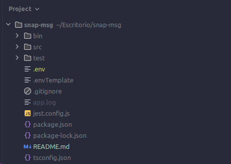

# snap-msg

## Estructura del proyecto:

1. **bin**: Contiene scripts utilitarios.
2. **src**: Contiene el código fuente del proyecto.
    - **api**: Contiene los controladores de la aplicación y sus manejadores de errores.
    - **database**: Contiene la configuración de la base de datos y los repositorios.
    - **services**: Contiene la lógica de negocio de la aplicación y del dominio.
    - **utils**: Contiene utilidades de la aplicación.
    - **config.ts**: Archivo de configuración de la aplicación con las variables de entorno.
    - **app.ts**: Archivo principal de la aplicación.
3. **test**: Contiene los tests del proyecto.
4. **.env**: Archivo donde se cargaran las variables de entorno.
5. **.gitignore**: Archivo que contiene los archivos que no se deben subir al repositorio.
6. **app.log**: Archivo log de la aplicacion.
7. **jest.config.js**: Archivo de configuración de jest.
8. **package.json**: Archivo de configuración de npm.
9. **package-lock.json**: Archivo de configuración de npm.
10. **tsconfig.json**: Archivo de configuración de typescript.

## Requisitos:
1. Node.js (>=14.0.0)
2. npm (>=6.0.0)
3. PostgreSQL
4. TypeScript

## Instrucciones de uso:

1. Clonar el repositorio.
2. Instalar las dependencias con `npm install`.
3. Crear un archivo `.env` en la raíz del proyecto siguiendo el ejemplo del archivo `.envTemplate`.
4. Crear la base de datos en PostgreSQL (puede usarse el script `/bin/initialize_database.sh`, pero seguramente haga falta cambiar el usuario y contraseña de PSQL). Este script creara la base de datos y tambien generara su estructura (dar permisos de ejecucion a todo `/bin` con `chmod +x *`).
5. Builder la app con `npm run build`.
6. Iniciar la app con `npm start`.
7. En caso de querer ejecutar los tests, correr `npm test` (Doc. de Jest: https://jestjs.io/docs/getting-started).

## Aspectos mas desafiantes y puntos de mejora:

1. **Tests**: Aunque se han implementado tests, se deben mejorar y añadir más tests. Tambien se deberia mejorar la calidad del codigo de estos, ya que no estan a la altura del resto del proyecto en cuestion de calidad. La mayor dificultad fue aprender como funcionan las librerias de testing en TS.
2. **Docker**

## Aclaraciones importantes:

1. Para correr los tests, si o si debe setearse la variable de entorno TEST_MATCH para que apunte al directorio de los tests.
2. Para levantar la base de datos, hay dos opciones:
- A. Correr el script `bin/initialize_database.sh` (dar permisos de ejecucion con `chmod +x bin/initialize_database.sh`) y dejar el "false" la variable de entorno `DB_SYNCHRONIZE`.
- B. Correr el script `bin/create_database.sh` (dar permisos de ejecucion con `chmod +x bin/create_database.sh`) y dejar en "true" la variable de entorno `DB_SYNCHRONIZE`.

## Env Vars:
1. **PORT**: Puerto en el que se levantara la aplicacion.
2. **LOG_ROUTE**: Ruta donde se guardara el log de la aplicacion.
3. **LOGGING**: true o false, si se quiere que la aplicacion logee.
4. **DB_DATABASE**: Se espera que sea "snapMsg".
5. **DB_USERNAME**: Usuario de la base de datos.
6. **DB_PASSWORD**: Contraseña del usuario de la base de datos.
7. **DB_HOST**: Host de la base de datos.
8. **DB_PORT**: Puerto de la base de datos.
9. **DB_SYNCHRONIZE**: true o false, si se quiere que la aplicacion sincronice la base de datos.
10. **DB_LOGGING**: true o false, si se quiere que la aplicacion logee las queries de la base de datos.
11. **DB_TYPE**: Tipo de base de datos, se espera que sea "postgres".
12. **MIGRATIONS_PATH**: Ruta donde se guardaran las migraciones de la base de datos.
13. **TEST_MATCH**: Ruta donde se guardaran los tests.